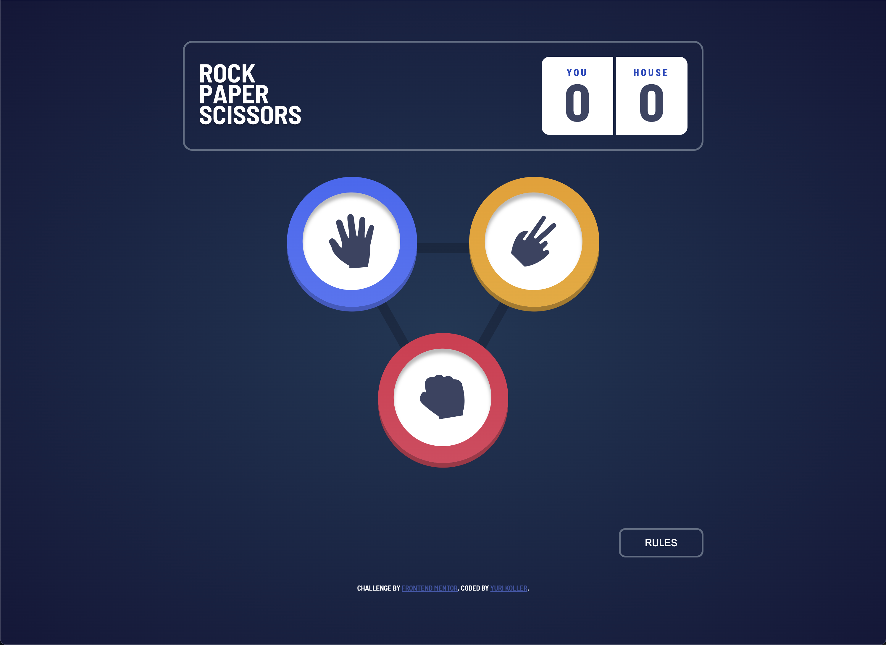

# Frontend Mentor - Rock, Paper, Scissors solution

This is a solution to the [Rock, Paper, Scissors challenge on Frontend Mentor](https://www.frontendmentor.io/challenges/rock-paper-scissors-game-pTgwgvgH). Frontend Mentor challenges help you improve your coding skills by building realistic projects. 

## Table of contents

- [Overview](#overview)
  - [The challenge](#the-challenge)
  - [Screenshot](#screenshot)
  - [Links](#links)
- [My process](#my-process)
  - [Built with](#built-with)
  - [What I learned](#what-i-learned)
  - [Continued development](#continued-development)
  - [Useful resources](#useful-resources)
- [Author](#author)

**Note: Delete this note and update the table of contents based on what sections you keep.**

## Overview

### The challenge

Users should be able to:

- View the optimal layout for the game depending on their device's screen size
- Play Rock, Paper, Scissors against the computer

### Screenshot



### Links

- Solution URL: [Add solution URL here](https://your-solution-url.com)
- Live Site URL: [Add live site URL here](https://your-live-site-url.com)

## My process

### Built with

- Semantic HTML5 markup
- CSS custom properties
- Flexbox
- Vanilla Javascript

### What I learned

I learned how to add sounds as well as creative animations to provide extra fun to the game:

```js
function playWoosh() {
        let woosh = new Audio("whoosh.mp3")
        woosh.play()
    }

    function playSlot() {
        let slot = new Audio('Slot.mp3')
        slot.play()
    }

    function playBassDrop() {
        let bassDrop = new Audio('Bass Drop.mp3')
        bassDrop.play()
    }

    function playSuccess() {
        let success = new Audio('short-success.mp3')
        success.play()
    }

    function playLoss() {
        let loss = new Audio('ooh-123103.mp3')
        loss.play()
    }

    function playTie() {
        let tie = new Audio('failure-drum.mp3')
        tie.play()
    }
```

```js 
async function genCPU() {
        playSlot()
        for (let i = 0; i < 24; i++) {
            cpuClone = active[Math.floor(Math.random() * 3)].cloneNode(true)
            lightUpRight.appendChild(cpuClone)
            cpuClone.style.position = 'static'
            cpuClone.style.transform = 'translate(0%, 0%)'
            cpuClone.style.cursor = 'default'

            if (i != 23) {
                await delay(120)
                cpuClone.remove()
            }
        }
        cpuClone.style.transition = '300ms'
        whoWins()
    }
```

### Continued development

I want to continue pushing my knowledge for things like probabilities, math equations, and localstorage.

### Useful resources

- [ChapGPT](https://www.chatgpt.com) - This helped me when I'm trying to find out why something might not be working.

- [w3schools](https://www.w3schools.com) - This site helps remind me of things I have forgotten.

## Author

- Github - [Rnsnceman](https://www.github.com/rnsnceman)
- Frontend Mentor - [@rnsnceman](https://www.frontendmentor.io/profile/rnsnceman)
- Twitter - [@yurikoller](https://www.instagram.com/yurikoller)
